### 🎬 now showing

- 🐶 **Incoming Software Engineering Intern at [Datadog](https://www.datadoghq.com/)**, starting winter 2027
- 🎓 CS major and AI minor at **NYIT** in Manhattan, class of 2028
- ✦ President of **NSBE @ NYIT**, Microsoft ECLSP fellow, America On Tech fellow, and part of Break Through Tech, ColorStack, and Code2040

### 🧰 the crew

  

### 🍃 behind the scenes

Born in New York, raised in Nigeria until I was 7, then grew up on Staten Island. Started college at 16. Off the keyboard I play guitar, crochet, do fashion (I took part in New York Fashion Week), collect cards, and rewatch Studio Ghibli films. Wanda is my favorite Marvel character.

   
  ✦ fin ✦ · the full feature, with a soot sprite game, plays at <a href="https://rori-portfolio.vercel.app">rori-portfolio.vercel.app</a>
   
  Howl's castle background art by <b>mint moss</b>

